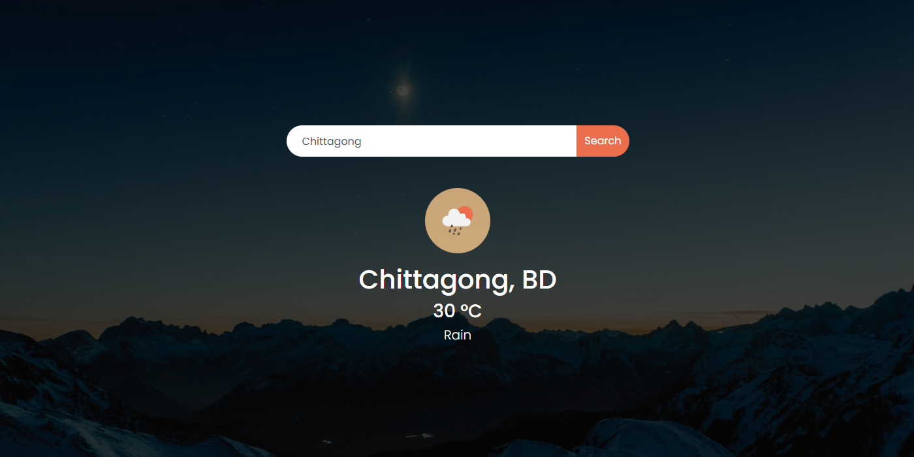

# Weather App
## ([Live Preview](https://tayab-pabel.github.io/weather-app/))
## Features
   - It's a vanilla js project using API.
   - Weather checking by input and get the weather result.
   - Responsive layout.
## Technology
   - HTML
   - CSS
   - Bootstrap
   - Javascript
   - API
## Tools
   - Visual Studio Code
   - Github
   - Chrome Dev Tools
## User Interface
